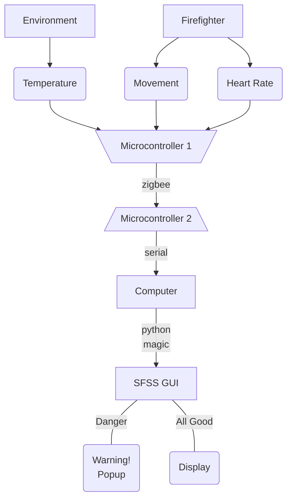

# Smart Firefighter Support System

## Texas State University - Senior Design 2019

### What is this?

This repository is the official GitHub page of the **Smart Firefighter Support System** sponsored by Texas State and the San Marcos Fire Department.

### What's in the SFSS git?

The SFSS git pages [https://git.txstate.edu/raw124/SFSS] [https://github.com/rob-wells/sfss/] will contain all code used in the development of the SFSS.

### What's the SFSS?

I'm glad you asked! SFSS stands for "**S**mart **F**irefighter **S**upport **S**ystem." The goal of this project is exactly as the name implies: to help our first responders do their jobs in the safest and *smartest* way possible.

### Ok, but what does it actually do?

You're on a roll with these questions! The SFSS is a wireless monitoring system to be worn by firefighters while in the line of duty. It can currently measure and display:

- Heart Rate
- Movement
- Environment Temperature

These metrics are collected from sensors attached to a microcontroller, sent over a Zigbee network and then displayed on the python based SFSS GUI which can be monitored by personnel on the scene. The ability to view these health metrics should help the on-scene decision makers to make informed, proactive decisions rather than rely on biased self-reporting.

### Sounds cool, but why not just have them wear Apple Watches?

Thats a fair point. They *could* wear something like an Apple Watch but they *could* also show up to fight fires in sports cars. It might look cool, but is it practical? Granted, if the department has an unlimited budget, it might work. Unfortunately though, that is not the case for a majority of fire departments.

The SFSS is open source, cheap to build and adaptable.

### What does the "flow" of the system look like?

Interesting question.

Here's a top level breakdown

### I'm sold. How do I use it?

First things first. Boot up that beautiful GUI.

