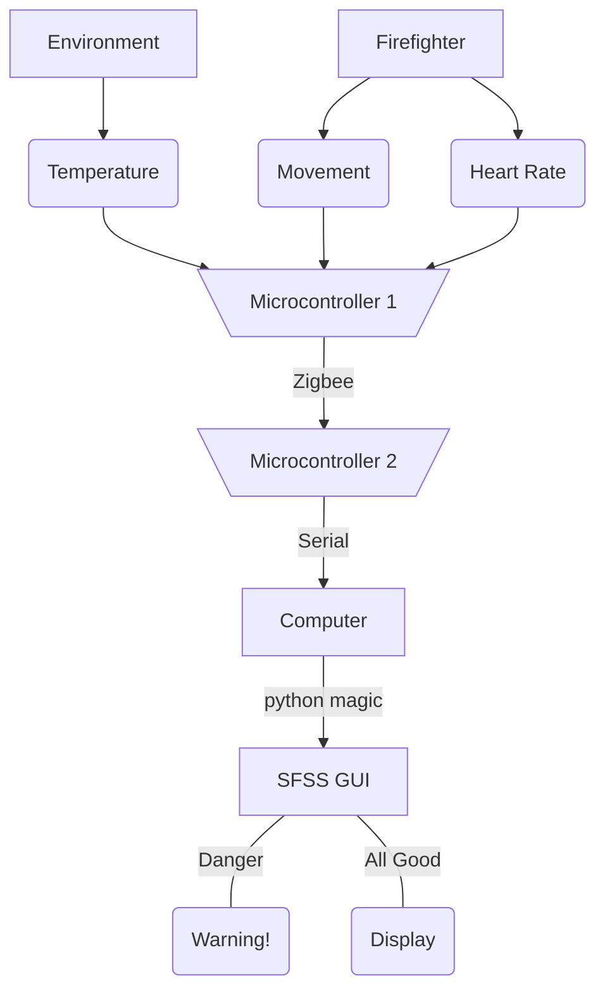

```mermaid
graph TD
    ENV[" Environment "]
    ENV-->TEMP(" Temperature ")

    FF[" Firefighter "]
    FF-->MOV(" Movement ")
    FF-->HR(" Heart Rate ")

    MC1[\" Microcontroller 1 "/]

    TEMP-->MC1
    MOV-->MC1
    HR-->MC1

    MC2[\" Microcontroller 2 "/]
    MC1 -- Zigbee --> MC2

    PC[" Computer "]
    GUI[" SFSS GUI "]
    MC2 -- Serial --> PC
    PC -- python magic --> GUI

    BAD(" Warning! ")
    GOOD(" Display ")
    GUI -- " Danger " --- BAD
    GUI -- " All Good "--- GOOD
```